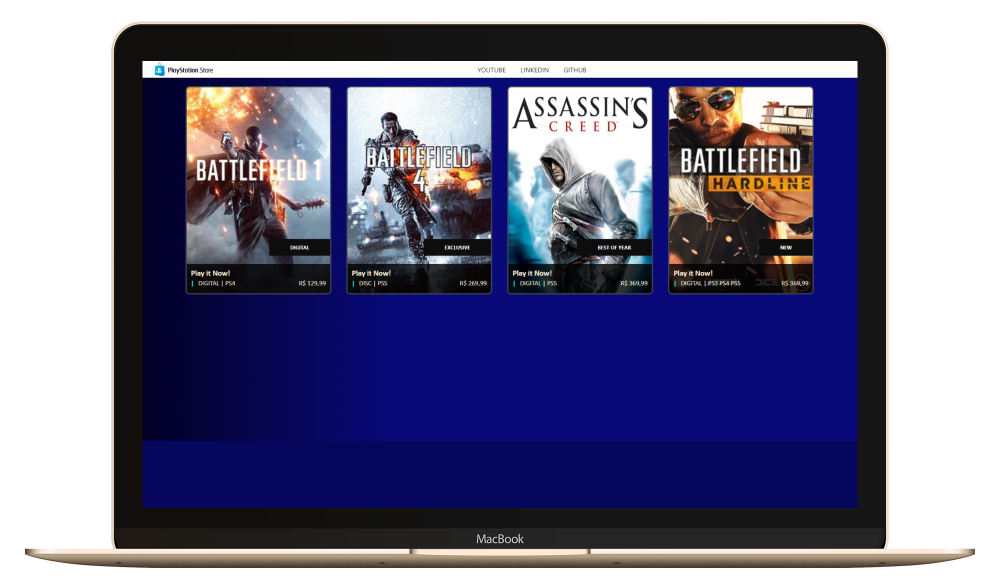

# Entrega de projeto - Recriando a Interface da PlayStation Store com Angular | DIO

Neste desafio de projeto, recriei a Playstation Store utilizando Angular. Este projeto tem como objetivo demonstrar a aplicação de conceitos fundamentais do Angular, incluindo a criação de componentes, organização do layout, refatoração de partes do código e a estruturação de um projeto escalável.

## Funcionalidades

- **Componentização**: Divisão da aplicação em componentes reutilizáveis para facilitar a manutenção e evolução do projeto.
- **Layout Responsivo**: Utilização de CSS e Angular Material para criar um layout atraente e responsivo.
- **Serviços e Injeção de Dependência**: Implementação de serviços para gerenciar dados e comunicação entre componentes.
- **Rotas**: Configuração de rotas para navegação entre diferentes partes da aplicação.
- **Refatoração de Código**: Melhoria contínua do código, mantendo-o limpo e organizado.
- **Organização do Projeto**: Estruturação do projeto de forma modular para facilitar a escalabilidade.

## Como Executar o Projeto

1. Clone o repositório:

   ```bash
   git clone https://github.com/fabiocasadossites/desafio-angular-playStationstore-dio.git
   ```

2. Navegue até o diretório do projeto:

   ```bash
   cd nome-do-repositorio
   ```

3. Atualize o projeto, Em seu terminal e na pasta do projeto

   ```bash
   npm install
   ```

4. Rodar o projeto

   ```bash
   ng serve
   ```

<br>

## 👨‍💻 Expert

<p>
    
    <p>&nbsp&nbsp&nbspFabio Augusto<br>
    &nbsp&nbsp&nbsp
    <a href="https://github.com/fabiocasadossites">
    GitHub</a>&nbsp;|&nbsp;
    <a href="https://www.linkedin.com/in/fabioasa/">LinkedIn</a>
&nbsp;|&nbsp;
    <a href="https://www.fabioaugusto.dev/">
    Portfolio </a>
&nbsp;&nbsp;</p>
</p>
<br/>
<p>

💻 com ❤️ por [Fabio Augusto](https://github.com/fabiocasadossites)
